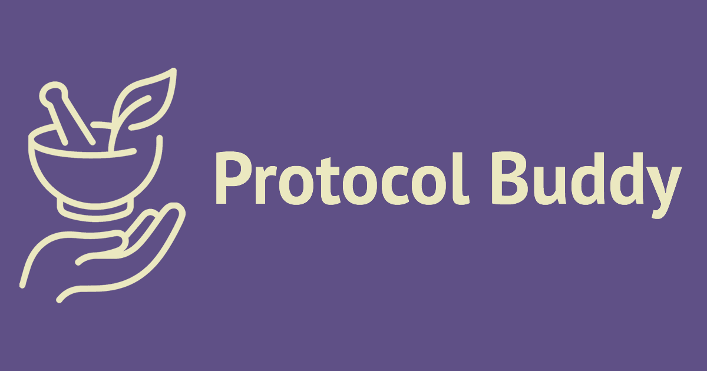

  

# Protocol Buddy

> **Note**: This is a public documentation repository. The source code is maintained in a private repository.

**Live App**: [https://protocol-buddy.vercel.app/](https://protocol-buddy.vercel.app/)

A Next.js web application that provides alternative health protocols with precision dosage calculators. The app features weight-based dosing, liquid concentration converters, and a paywall system with Stripe integration.

## Features

- **Protocol System**: 60+ protocols covering vitamins, minerals, antiparasitics, metabolic support, detoxification, and more
- **Dosage Calculators**:
  - Weight-based calculations (kg/lb)
  - Liquid dose converter (mg/ml calculations)
  - Powder solution calculator (dissolving powders in liquid)
  - Static dosing options
- **Calendar Integration**: Set reminders and add protocols to your calendar
- **Print to PDF**: Export protocols and dosage information as PDF documents
- **Saved Protocols**: Bookmark and manage your favorite protocols
- **Payment Integration**: Paywall system with Stripe checkout for premium access
- **User Tracking**: Vercel KV storage for access state management
- **Dark Mode**: Theme support with next-themes

## Tech Stack

### Frontend

- **Next.js 15** with App Router and Turbopack
- **React 18** with TypeScript
- **Radix UI** components for accessible UI
- **Tailwind CSS** for styling
- **next-themes** for dark mode support

### Backend & Services

- **Vercel KV** for user data storage
- **Stripe** for payment processing and subscription management
- **React Hook Form + Zod** for form validation

## Core Architecture

### Protocol System

- **Protocol Definition**: Each protocol is a TypeScript object with standardized schema
- **Protocol Interface**: Dosage calculations, categories, and safety information
- **Categories**: Vitamins, minerals, antiparasitics, metabolic support, detoxification, circulation, cognitive, immune support, pain relief, respiratory, antibacterial, antiviral, anti-inflammatory

### Dosage Calculators

- **Weight-based Calculator**: Supports both kg and lb with min/max dosing per kg
- **Liquid Dose Converter**: For liquid supplements with mg/ml calculations
- **Powder Solution Calculator**: Calculate concentrations when dissolving powders in liquids
- **Static Dosing**: For non-weight-based protocols
- **Form Validation**: Zod schemas with comprehensive error handling
- **Visual Aids**: Concentration flow visualization for better understanding

### Payment & Access Control

- **Stripe Integration**: Checkout sessions for premium access
- **User Tracking**: Vercel KV storage for user access state and saved protocols
- **Paywall Component**: Conditional rendering based on user access status

### State Management

- **Zustand**: Lightweight state management for global app state
- **React Hook Form**: Form state and validation
- **next-themes**: Theme persistence and dark mode

## Notes

All rights reserved.

**Disclaimer**: This app provides educational information only and is not a substitute for professional medical advice. Always consult a healthcare provider before starting any supplement or treatment protocol.
